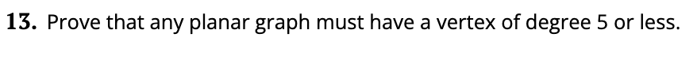
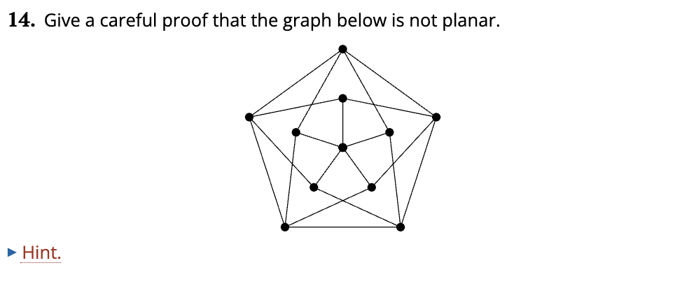
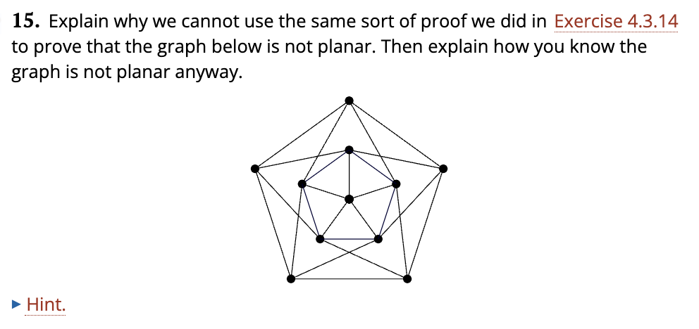

# Planar Graphs

Problem 13

- The sum of the degrees of all the vertices equals 2 times the number of edges. In a graph with all vertices being of >6 degrees, the minimum $\Sigma$ deg(v) can be is 6v.
- 2e = $\Sigma$ deg(v) >= 6v
- 2e >= 6v
- e>=3v
- However, this contradicts the e<=3v-6 theorem for planar graphs,
since 3v-6>=3v cannot be true, therefor a planar graph must have a degree of 5 or less.

 

Problem 14

- Let's assume this is a planar graph, so v-e+f=2 must be true for the graph. This graph has 11 vertices, 20 edges so 11-20+f=2 so f = 11, thus this graph has 11 faces. 

- This graph has a girth of 4. Since in a planar graph g*f<=2*e, 4f<=40, f<=10. But f=11, so this cannot be a planar graph.

- An additional way to immediately tell that this graph is not planar is that it visibly contains $K_5$ as a minor, which according to Kuratowski's theorem means it is not planar. https://www.ams.org/journals/bull/2006-43-01/S0273-0979-05-01088-8/S0273-0979-05-01088-8.pdf

Problem 15

- Let's assume this is a planar graph, so v-e+f=2 must be true for the graph. This graph has 11 vertices, 25 edges so 11-20+f=2 so f = 11, so this graph has 16 faces.

- This graph now has a girth of 3. Since in a planar graph g*f<=2*e, 3f<=50, f<=16(2/3). And f=16, so we cannot come to the conclustion that this is not a planar graph just from this.

- This graph does contain the prevoius graph as a subgraph, however, and we know that graph is not planar, so we know that this graph is not planar.